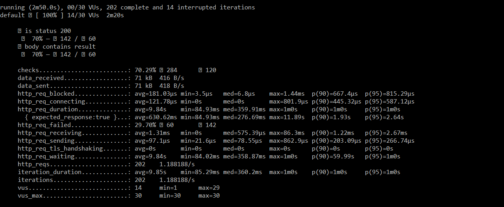
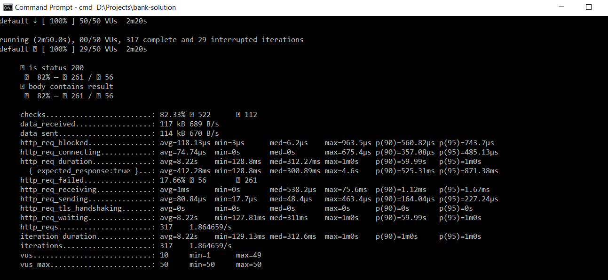

# :bank: Core Banking Solution
A core banking solution with microservices using Domain Driven Design and Event Sourcing.

According with **[Martin Fowler]**(https://martinfowler.com/bliki/CQRS.html) 
> At its heart is the notion that you can use a different model to update information than the model you use to read information. 
> For some situations, this separation can be valuable, but beware that for most systems CQRS adds risky complexity.

## Resources that was used for the project
- https://stackoverflow.com/questions/29558014/domain-model-and-business-logic-confusion
- https://medium.com/swlh/atm-an-object-oriented-design-e3a2435a0830
- https://github.com/lilienth/ddd-banking-example
- https://github.com/vmudigal/microservices-sample
- https://martinfowler.com/eaaDev/AccountingTransaction.html
- https://coding-time.co/transactions-event-sourcing/

## Encountered problems that was shared on https://stackoverflow.com/
- https://stackoverflow.com/questions/71570968/docker-compose-up-service-container-is-up-and-running-but-swagger-not-working
- https://stackoverflow.com/questions/71572351/feign-retryableexception-connection-refused-connection-refused-executing-get
- https://stackoverflow.com/questions/71456141/java-using-mybatis-with-doman-driven-design-and-event-sourcing-pattern
- https://stackoverflow.com/questions/71565594/spring-boot-rabbitmq-java-net-connectexception-connection-refused
- https://stackoverflow.com/questions/71502885/can-command-pattern-return-a-value-transaction
- https://stackoverflow.com/questions/71539058/exception-in-thread-main-java-lang-unsupportedclassversionerror-docker-compose
- https://stackoverflow.com/questions/71485070/adding-dependecy-on-module-in-gradle-java

## There are three microservices:

- **Account Query Service** : This microservice is responsible for read information about the accounts and transactions using the read database.
- **Account Command Service** : This microservice is responsible for managing accounts and transactions. A user can open an account, deposit funds and withdraw funds.
- **Customer Service** : This microservice is responsible for managing customers. There are some operations, such as creating a customer, list of all customers, find customer by Id.

### Concepts used ###
- Event-Driven Microservices
- CQRS Design Pattern
- Event Based Messages
- Domain Driven Design
- RabbitMQ
- NoSQL database with MongoDB
- Postgres
- JUnit
- SpringBoot
- MyBatis
- Gradle

# Requirements & Deployment
[Docker Desktop](http://www.docker.io/gettingstarted/#h_installation) has to be installed and to be run. 

**Step 1:**  Clone the repo

```
git clone https://github.com/dogaanismail/bank-solution.git
```

**Step 2:** Open IDE that can build Spring Boot project (Ex: Netbeans, Eclipse, Intellij IDEA,
etc.)

**Step 3:** Gradle will sync the project and it takes a few minutes<br />

**Step 4:** Clean and build the project by using gradle from IDE or terminal

* gradlew clean
* gradlew build

**Step 5:** Go inside the project directory from command prompt terminal

```
cd bank-solution
```

**Step 6:** Start the docker containers using the following command

```
docker-compose up -d
```

The process will take a few minutes. 7 containers must be started.

* **account-query-service**
* **account-cmd-service**
* **customer-service**
* **customerdb**
* **bank_rabbitmq**
* **querydb**
* **cmddb**

**Step 7:** If there is no problem, you must be able to access Rest API by using Swagger UI

# Test Scenarios Steps #
**Step 1:** Create a customer and get customer id that has just been created

**Step 2:** Open an account by using Account Command Service with CustomerId and get account id that has just been created

**Step 3:** Create a transaction on an account with account id by using Account Command Service  

**Step 4:** By using Account Query Service, account and transactions can be seen by using Swagger

# Swagger UI links #
* **Customer Service: http://localhost:5001/swagger-ui.html**
* **Account Command Service: http://localhost:5002/swagger-ui.html**
* **Account Query Service: http://localhost:5003/swagger-ui.html**

### EndPoints ###

| Service         | EndPoint                                       | Method | Description           |
|-----------------|------------------------------------------------|:------:|-----------------------|
| Account Command | /api/v1/account/openAccount                    |  POST  | Open an account       |
| Account Command | /api/v1/transaction/createTransaction          |  POST  | Create a transaction  |
| Account Query   | /api/v1/account/getAccounts                    |  GET   | List of accounts      |
| Account Query   | /api/v1/transaction/getTransactions/{accountId}|  GET   | Get By AccountId      |
| Customer Service| /api/v1/customer/createCustomer                |  POST  | Create a customer     |
| Customer Service| /api/v1/customer/get/{customerId}              |  GET   | Get by Id             |   
| Customer Service| /api/v1/customer/getCustomers                  |  GET   | List of customers     |

# RabbitMQ

Open [http://localhost:15672/](http://localhost:15672/)

and use the login credential

```
username: guest
password: guest
```

# Customer Service Database - Postgres

## Schema

**postgres_init.sql** has necessary database schema in DDL

## Access to postgres:

* `localhost:5432`
* **Username:** postgres (as a default)
* **Password:** postgres (as a default)

# Account Query Service Database - Postgres

## Schema

**postgres_init.sql** has necessary database schema in DDL

## Access to postgres:

* `localhost:5432`
* **Username:** postgres (as a default)
* **Password:** postgres (as a default)

# Account Command Service Database - MongoDB EventStore

## Access to mongoDB:

* `localhost:27017`


## Important Choices

Financial sector is very serious and there must not be any mistake. Every transaction should be recorded tightly and data loss should be minimized.

* Working with microservices
* Implementations of Doman Driven Design
* Implementations CQRS Design Pattern
* Implementations Event Based Messages, such as FundsDepositedEvent, FundsWithDrawnEvent, TransactionCreatedEvent etc.
* Using MyBatis for Query side to improve performance

## Transaction per second (TPS)

A load testing script has been written in **load-testing** folder. Run below command in the project directory to perform a load test from terminal <br />
*For windows host machine and docker K6 container*

```
docker run --rm -i loadimpact/k6 run - <load-testing/script.js
```

*For Linux host machine and docker K6 container*

```
docker run --network="host" --rm -i loadimpact/k6 run - <load-testing/script.js
```




## Scaling Horizontally ##
We can increase the number of virtual machines,instances,servers and also containers with low downtime and cost.
Service providers, such as Azure and AWS have automatic scaling.They can increase and decrease resources according to our requirements at any given time. They can scale up or out when traffic to our application is at its peak and scale down when demand is lessened. This provides organizations with more efficient and cost-effective scaling.
